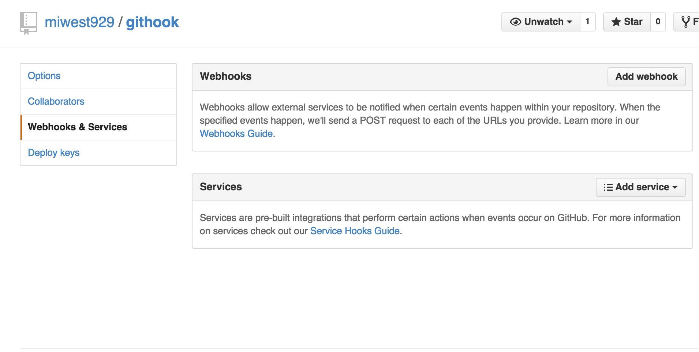
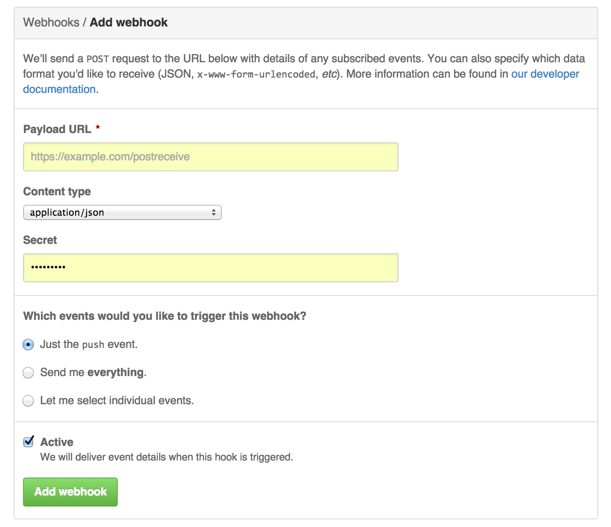

# Githook

A simple Ruby DSL for describing a Github bot. Github webhooks are the events that the bot must react to.

## Installation
First, you need to install this gem. You need to have Ruby and Rubygems installed.
  $ gem install githook

## Example

```ruby
# When a pull_request event is received with action that is either 'opened' or 'reopened'
# then invoke block

# You must provide an 'access_token' so that your bot is authorized to perform Github actions to your repos
mybot = Githook::Bot.new(access_token: <your-access-token>)
mybot.on("pull_request").when("opened").when("reopened").perform do |pr|
  if pr.description.empty?
    pr.comment("Hey, add a description! You think we're mind readers!?")
  end
  
  if pr.title.contains?("cheese")
    pr.comment("Why is there cheese in the title?")
  end
  
  pr.add_label("needs-work")
end

# Start the bot server
Githook::Server.new(mybot).listen('/payload')
```

## How to configure your bot to receive web hooks from Github




